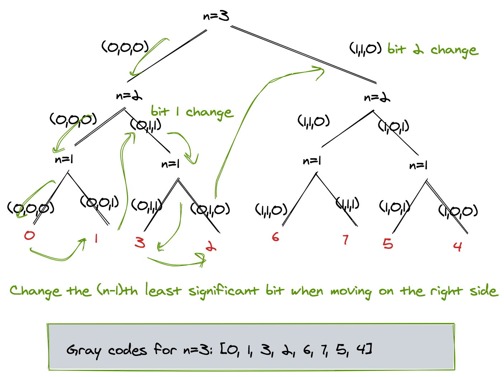

# Generating Gray Codes

This is a naturally recursive problem. The general idea is to construct a binary tree with root representing the most significant bit and the leaf representing the least significant bit. If we consider the least significant bit as bit 1, then every time we move to the right branch of the tree, we change the nth most significant bit. Once the left branch is completed the last number is passed to the right side as shown in the figure.



## Implementation
`grayCodes.cpp` file contains an implementation of generating gray codes using C++. The code is also pasted below for convenience. To implement the problem, the recursive version of the function `grayCodes()` is called with the following parameters:

- `n`: The nth significant bit 
- `codes`: The array that stores the gray codes. Its size is 2^n
- `index`: It is a reference variable that keeps track of the index of the `codes` array, where the next number is to be placed.
- `number`: The current gray code number. We add or subtract bit*2^(n-1) to this number when moving to the right branch of the tree.
- `binArray`: A binary array of bits that is passed around in the tree
- `pow2`: The value of 2^(n-1) so that it does not have to be computed time and again.

The base case of the recursive function is when we are at the leaf node of the tree, i.e., n=1

The general case simply calls `grayCodes()` recursively with (n-1) to the left, (n-1) to the right. Before invoking the right side the `number` is updated by the corresponding bit change.

### Complexity
For `n` bits the time complexity of the algorithm is `O(2^n)` as it traverses the entire binary tree with `n` levels. The space complexity is `O(n)` as `binArray` is used whose size is `O(n)`. Note that we computed the value of `2^n` right at the start, to save time of its computation.

### Code
The C++ code is given below:

```cpp
//
//  grayCodes.cpp
//  
//
//  Created by Mehreen Saeed on 3/9/21.
//

#include <stdio.h>
#include<cmath>
#include<vector>
#include<iostream>
using namespace std;
class Solution {
public:
    vector<int> grayCode(int n) {
        int number = 0;
        int index = 0;
        int pow2 = pow(2,n);
        vector<int> codes(pow2, 0);
        vector<bool> binArray(n,0);
        
        grayCode(n,codes,index,number,binArray,pow2/2);
        
        return codes;
    }
    
    void grayCode(int n, vector<int>&codes, int &index, int &number, vector<bool>&binArray, int pow2)
    {
        
        
        
        //base case
        if (n==1)
        {   //update codes array with two numbers
            codes[index] = number;
            index=index+1;
            binArray[n-1] = !binArray[n-1];
            if (binArray[n-1]) //last bit is 1
                number = number+1;
            else
                number = number-1;
            codes[index] = number;
            index = index+1;
            return;
            
        }
        //general case
        grayCode(n-1,codes,index,number,binArray,pow2/2);
        binArray[n-1] = !binArray[n-1];
        if (binArray[n-1])
            number = number+pow2*binArray[n-1];
        else
            number = number-pow2;
        grayCode(n-1,codes,index,number,binArray,pow2/2);
        
    }
};

int main()
{
    Solution soln;
    vector<int> codes = soln.grayCode(4);
    cout << "\n";
    for (int i=0;i<codes.size();++i)
        cout << codes[i] << " ";
    
    return 0;
}
```